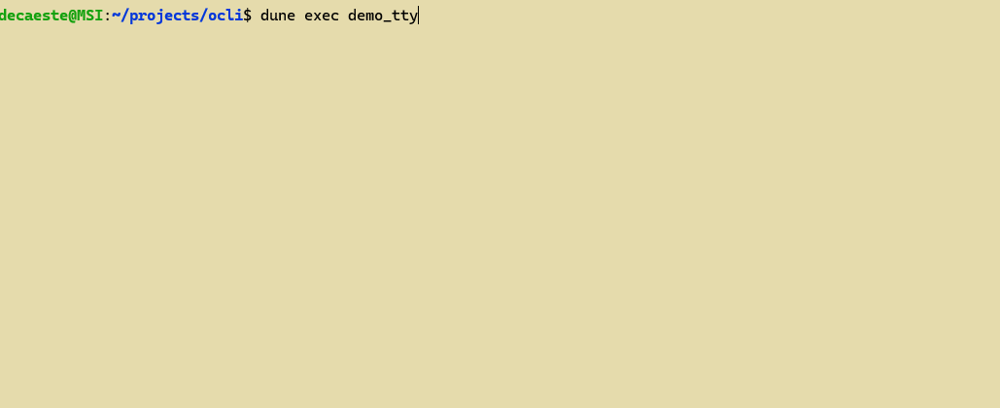
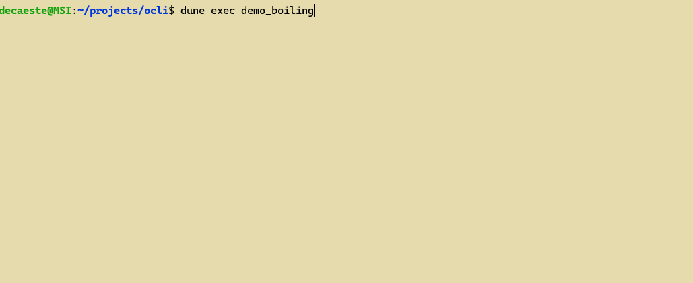

# OCaml CLI Mini-framework


## Apps
### Demos
+ [demo_tty](demo/demo_main.ml), a sample of all implemented ansi features and a quick way to visually check the behaviour of the framework on a given terminal.


+ [demo_boiling](demo/demo_boiling.ml), ongoing sandbox on ascii animation


### Newbase
+ [rebase_edit](rebase/rebase_edit.ml), an interactive git rebase editor, and it's associated [newbase](rebase/newbase.t/newbase) script, intended as a drop-in replacement for `git rebase -i`


To get `rebase_edit` and `newbase`, you can [install them from source](#install-rebase-from-source) or get them from the github release:

```console
$ wget https://github.com/NyuB/ocli/releases/latest/download/newbase
$ wget https://github.com/NyuB/ocli/releases/latest/download/rebase_edit
$ chmod +x newbase rebase_edit
$ # Supposing ~/bin is in your PATH, replace with the desired installation root
$ mv newbase ~/bin/ 
$ mv rebase_edit ~/bin/
```


## Core libraries
+ [tea](tea/tea.mli), Elm-inspired application structure
+ [tty](tty/tty.mli)
    - Wrappers around OCaml Stdlib termios functions
    - Wrappers around ANSI terminal control sequences

## Development

### Requirements

- Linux
- opam
- terminal with termios support

### Build

```bash
opam switch create .
dune build
```

### Run the tty demo

```bash
make demo
```

**NB:** the demo includes indications to check if it is behaving correctly on your terminal

### Test suites
Run the tests:
```bash
make test
```

Update acceptance tests with the current outputs:

```bash
make test-promote
```

### Install newbase from source

[rebase](rebase) provides two binaries:
- [rebase_edit](rebase/rebase_edit.ml) is the interactive rebase editor, meant to be called by git with the rebase file.
- [newbase](rebase/newbase.t/newbase) is a bash wrapper around `git rebase`. Its main purpose is to point git to rebase_edit as rebase editor along few other convenience features.

```
make install-newbase
```

Installation root can be chosen with the INSTALL_ROOT variable (defaults to `$HOME/bin`). `rebase_edit` and `newbase` will be placed at `${INSTALL_ROOT}/rebase_edit` and `${INSTALL_ROOT}/newbase`

```
make install-newbase INSTALL_ROOT=/somewhere/in/your/path
```